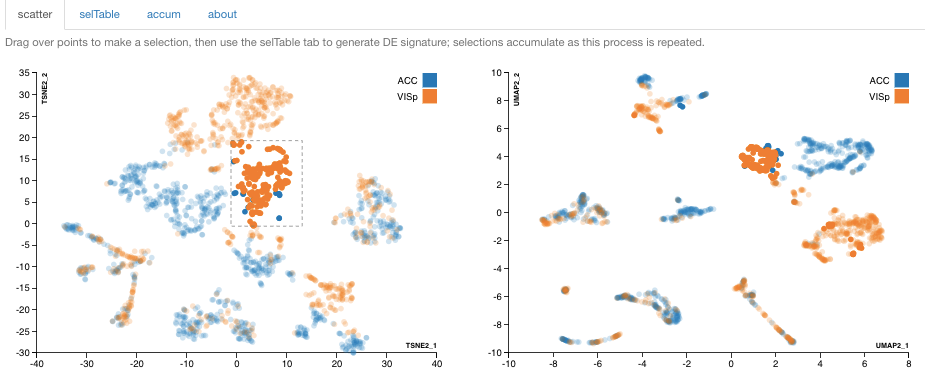
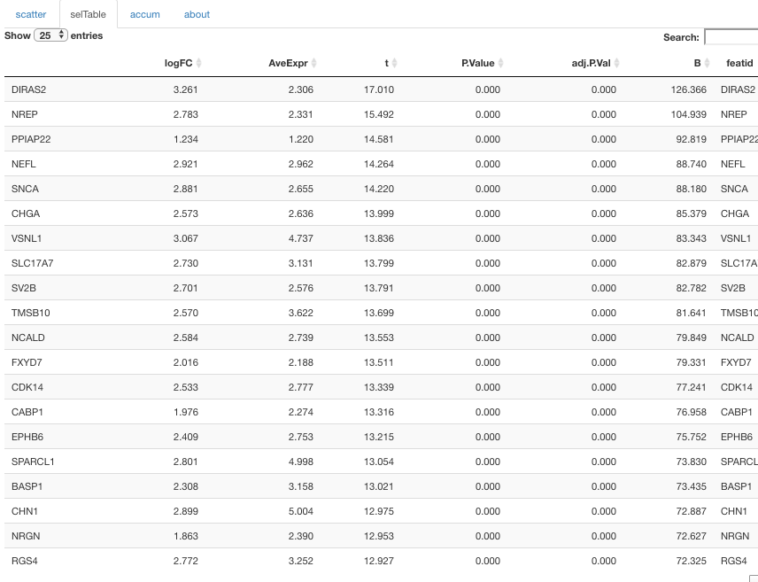

```{r setup,echo=FALSE,results="hide"}
suppressPackageStartupMessages({
library(pcmp)
options(digits=3)
})
```

# Introduction

Visualization of single-cell RNA-seq data is supported in many
software environments and tools.  pcmp was devised to address
the following aims

- use Rstudio's crosstalk to foster linked/brushable selections
in multiple panels
- record manual selections of clusters with indicator variables added
in the colData of the input SingleCellExperiment instance
- provide statistical information on expression patterns
that distinguish selected clusters, and on expression-based sources
of variation within clusters
- for nuclear sequencing applications, support introduction and
interpretation of measures of relative abundance of immature
transcripts

The basic interface has the following appearance:

<!--
{:height="500px"}
-->


The input data are obtained from a SingleCellExperiment
instance, in this case a
stratified random sample of 1800 cells from the 
Allen Brain Atlas single-nucleus RNA-seq repositories
from the ACC (anterior cingulate cortex) and
VIS (primary visual cortex) brain regions.

The data are supplied in the pcmp package as the
object `sce300xx`.
The projections are retrieved from the reducedDims
component of `sce300xx`, and **are not computed by pcmp**.  Each point 
represents a single cell.  Points are colored using
palettes determined by crosstalk, and the groupings are
determined by the `stratby` control, which gives access to
all 'discrete' variables in the colData of the input
SingleCellExperiment.

A couple of motivations for this app are visible in the following display,
which was created by selecting a small group of mostly orange points
in the center of dimensions 1,2 of the 2-dimensional t-SNE projection.  You
can see dashed box boundaries on the left panel.  The color scheme
is determined by the stratby selection.
In this display color corresponds to 
tissue source: orange for primary visual cortex, blue for anterior
cingulate cortex.



Cells are blurred in all projections
if not selected.  
Most of the orange cells in the t-SNE selection
are clustered together in the UMAP projection on the right,
but a few are 
scattered to other groups that seem more remote in the
UMAP view.

# Installation and execution

The package can be installed using R 3.5 or above with the command
```
devtools::install_github("vjcitn/pcmp")`
```

After successful installation, use
```
library(pcmp)
pcmpApp(sce300xx)
```
to work with the sample from the Allen Brain Atlas data.

In general, with any SingleCellExperiment instance with 
multiple projections represented in reducedDims, with equal
numbers of dimensions per projection, and at least 4 such
dimensions, `pcmpApp` should work.  We do not know at present
how well crosstalk scales with more than 2000 or so cells.

# Additional features

## Differential expression: selected cells vs. all others

A very simple approach for characterizing genes whose
expression may distinguish a selected cluster is provided.
We use limma on the log(assay(sce)+1) and keep the top 20
genes.  **The results for a given selection are only computed
if the selTable tab is selected after the selection.  You will
have to wait until the table appears to make a new selection.**

Here is the table that appears after the selTable tab is
chosen after the selection shown in the previous display.



This table is stored in a special object in `.GlobalEnv`
for later use.

## Recording selections

### Plotting selections after a session

`pcmpApp` returns an object of class `SingleCellExperiment`.  The
package includes a small serialized instance with
some data from `sce300xx`,  called `vigAccum`.

```{r lkvi}
pcmp::vigAccum
```

We can plot our selections in a given projection using `plotSelMap`.
```{r lklksel}
plotSelMap(pcmp::vigAccum, "TSNE2", 1, 2)
```

### Biplots of discriminating expression patterns

Selections can be accompanied with lists of genes
associated with cluster membership.  By default these
genes are developed using limma.  The `biplotSel`
function displays a PCA-based biplot using the expression
data available for a selected subset of the discriminating
genes for any cluster.

```{r lkbi}
biplotSel(pcmp::vigAccum, selnum=4, ntop=10)
```
