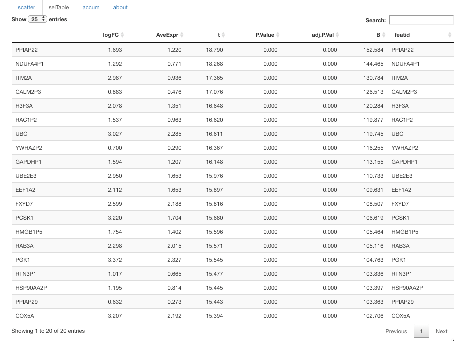
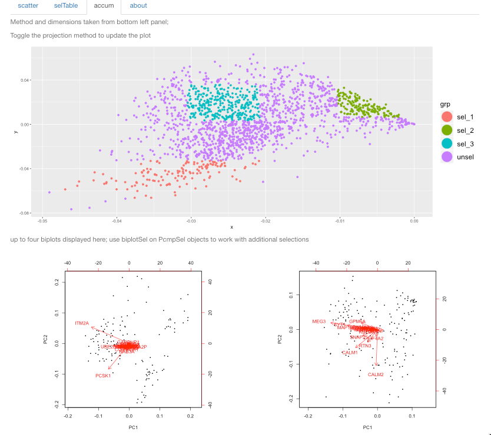

```{r setup,echo=FALSE,results="hide"}
suppressPackageStartupMessages({
library(pcmp)
options(digits=3)
})
```

# Introduction

Visualization of single-cell RNA-seq data is supported in many
software environments and tools.  pcmp was devised to address
the following aims

- use Rstudio's crosstalk to foster linked/brushable selections
in multiple panels
- record manual selections of clusters as lists of cells
- provide some statistical information on expression patterns
that distinguish selected clusters, and on expression-based sources
of variation within clusters
- for nuclear sequencing applications, support introduction and
interpretation of measures of relative abundance of immature
transcripts

The basic interface has the following appearance:

<!--
{:height="500px"}
-->


The input data are obtained from a SingleCellExperiment
instance, in this case a
stratified random sample of 1800 cells from the 
Allen Brain Atlas single-nucleus RNA-seq repositories
from the ACC (anterior cingulate cortex) and
VIS (primary visual cortex) brain regions.

The data are supplied in the pcmp package as the
object `sce300xx`.
The projections are retrieved from the reducedDims
component of `sce300xx`, and **are not computed by pcmp**.  Each point 
represents a single cell.  Points are colored using
palettes determined by crosstalk, and the groupings are
determined by the `stratby` control, which gives access to
all 'discrete' variables in the colData of the input
SingleCellExperiment.

A couple of motivations for this app are visible in the following display,
which was created by selecting a small group of mostly blue points
in the lower part of dimensions 3,4 of the UMAP projection.  You
can see dashed box boundaries on the left panel.  The color scheme
is determined by the stratby variable, in this case PIMMquart,
a labeling of cells based on the average
value per cell (over all genes) of the fraction of reads mapping
to introns.


Cells are blurred in all projections
if not selected.  Color in this display is a measure of fraction of
immature mRNA (average over all genes of ratio of count of intronic reads to total read count for each cell).  The cluster identified in dimensions 3,4 of UMAP projection
is scattered in the analogous t-SNE projection.

# Installation and execution

The package can be installed using R 3.5 or above with the command
```
devtools::install_github("vjcitn/pcmp")`
```

After successful installation, use
```
library(pcmp)
pcmpApp(sce300xx)
```
to work with the sample from the Allen Brain Atlas data.

In general, with any SingleCellExperiment instance with 
multiple projections represented in reducedDims, with equal
numbers of dimensions per projection, and at least 4 such
dimensions, `pcmpApp` should work.  We do not know at present
how well crosstalk scales with more than 2000 or so cells.

# Additional features

## Differential expression: selected cells vs. all others

A very simple approach for characterizing genes whose
expression may distinguish a selected cluster is provided.
We use limma on the log(assay(sce)+1) and keep the top 20
genes.  **The results for a given selection are only computed
if the selTable tab is selected after the selection.  You will
have to wait until the table appears to make a new selection.**

Here is the table that appears after the selTable tab is
chosen after the selection shown in the previous display.



This table is stored in a special object in `.GlobalEnv`
for later use.

## Recording selections

### Seeing what has been selected in the session

The `accum` tab allows you to review the scope of the
series of selections.  Currently the display is fairly
primitive.  The color scheme is based on R's default mapping, with
unselected points 'gray', and selection n receiving color n+1.
The display below shows, in PC3 vs PC4 space, the results
of 6 selections, one of which (red) was based on a cluster
found in a different projection.



### An object describing selections from a session

`pcmpApp` returns an object of class `PcmpSels`.  The
package includes a serialized instance, `vigAccum`,
corresponding to the selections shown above.

There
are currently two methods defined on this object:
`cellSets` and `geneTable`.  `cellSets` retrieves
the colNames entries for cells in each selection
event.  `geneTable` retrieves the limma/eBayes/topTable
outputs for "top 20" cluster-discriminating genes.

```{r lkcs}
vigAccum
sapply(cellSets(vigAccum), length) # sizes of selections
head(geneTable(vigAccum),3) # 20 genes for each selection
```

# Assessing expression heterogeneity within selected clusters

We defined a `biplotSel` function to work with the output
of a session.  A parameter determines how many of the genes
identified as discriminatory are used to conduct a PCA
of the expression data from a selected cluster.

```{r lkbp,fig.width=8}
par(mfrow=c(2,2), mar=c(3,3,1,1))
xx =sapply(1:4, function(i)biplotSel(sce300xx, vigAccum, i))
par(mfrow=c(1,1))
```

This phase of the exploration clearly needs additional
control and enhancement.

# Next steps

We want to have biplot-like enhancements of the basic
clustering projections, to show features and pathways 
associated with cluster distinction.

More control over within-cluster heterogeneity visualization
and analysis will be useful.

We also need to consider scalability of the crosstalk infrastructure,
incorporation of non-rectangular selection methods, dynamic projections
for 3-d visualization.
