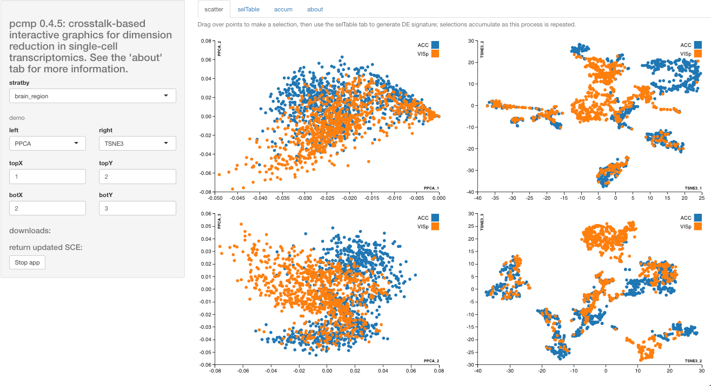
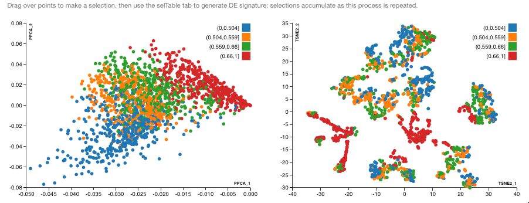

# Introduction

Visualization of single-cell RNA-seq data is supported in many
software environments and tools.  pcmp was devised to address
the following aims

- use Rstudio's crosstalk to foster linked/brushable selections
in multiple panels
- record manual selections of clusters as lists of cells
- provide some statistical information on expression patterns
that distinguish selected clusters, and on expression-based sources
of variation within clusters
- for nuclear sequencing applications, support introduction and
interpretation of measures of relative abundance of immature
transcripts

The basic interface has the following appearance:

<!--
{:height="500px"}
-->


The input data are obtained from a SingleCellExperiment
instance, in this case a
stratified random sample of 1800 cells from the 
Allen Brain Atlas single-nucleus RNA-seq repositories
from the ACC (anterior cingulate cortex) and
VIS (primary visual cortex) brain regions.

The data are supplied in the pcmp package as the
object `sce300xx`.
The projections are retrieved from the reducedDims
component of `sce300xx`, and **are not computed by pcmp**.  Each point 
represents a single cell.  Points are colored using
palettes determined by crosstalk, and the groupings are
determined by the `stratby` control, which gives access to
all 'discrete' variables in the colData of the input
SingleCellExperiment.

A couple of motivations for this app are visible in the following display,
which was created by selecting a small group of mostly blue points
in the lower part of dimensions 3,4 of the UMAP projection.  You
can see dashed box boundaries on the left panel.  The color scheme
is determined by the stratby variable, in this case PIMMquart,
a labeling of cells based on the average
value per cell (over all genes) of the fraction of reads mapping
to introns.



Cells are blurred in all projections
if not selected.  Color in this display is a measure of fraction of
immature mRNA (average over all genes of ratio of count of intronic reads to total read count for each cell).  The cluster identified in dimensions 3,4 of UMAP projection
is scattered in the analogous t-SNE projection.

# Installation and execution

The package can be installed using R 3.5 or above with the command
```
devtools::install_github("vjcitn/pcmp")`
```

After successful installation, use
```
library(pcmp)
pcmpApp(sce300xx)
```
to work with the sample from the Allen Brain Atlas data.
